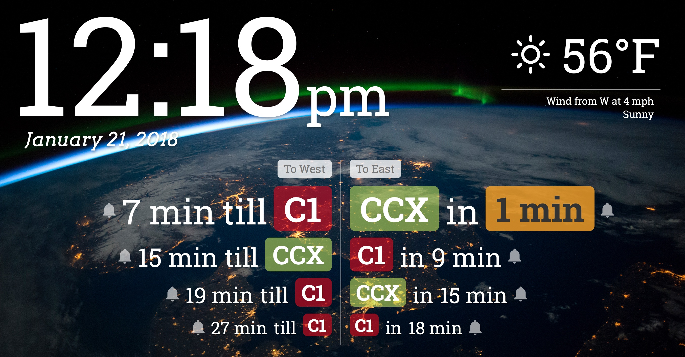

# Smart Home Dashboard

Project lead: [Harvey Shi](https://github.com/rvshi)

Tools used: HTML, CSS, JQuery, [Web Speech API](https://developer.mozilla.org/en-US/docs/Web/API/Web_Speech_API), [Transloc API](http://transloc.com)

Description: The Smart Home Dashboard is a website designed to display real-time information that is helpful to Smart Homers.
- It has a clock, weather data, and taps into the Transloc bus-tracking API to help people at the Smart Home get to their buses on time.
- There is also a notification interface for the buses that uses the Web Speech API to alert people over the home's speaker system when their bus is getting close to the stop.
- Google Chrome is the recommended browser, but Safari and Firefox seem to work just fine as well.